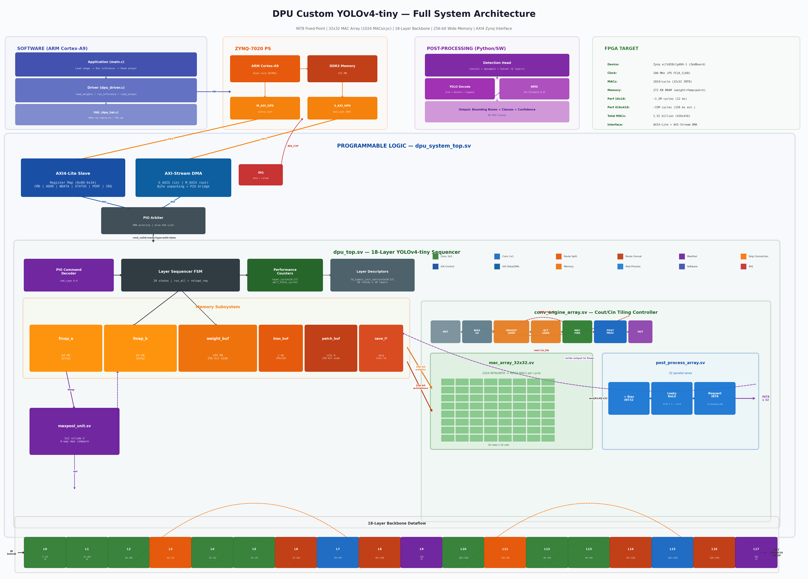

# DPU Custom YOLOv4-tiny

A complete **Deep Learning Processing Unit (DPU)** designed from scratch for real-time YOLOv4-tiny object detection inference. INT8 fixed-point arithmetic, 32x32 systolic MAC array, and full Zynq SoC integration.

<p align="center">
  
</p>

---

## Highlights

| Feature | Specification |
|---------|---------------|
| **Model** | YOLOv4-tiny (18-layer CSPDarknet backbone) |
| **Precision** | INT8 fixed-point (weights, activations, accumulator INT32) |
| **Compute** | 32x32 MAC array = **1024 MACs/cycle** |
| **Memory** | 256-bit wide ports (32 bytes/cycle) for weights and activations |
| **Layers** | Conv 3x3, Conv 1x1, MaxPool 2x2, Route (split/concat) |
| **Activation** | Leaky ReLU (hardware: `x >= 0 ? x : x >>> 3`) |
| **Interface** | AXI4-Lite (control) + AXI4-Stream (DMA bulk transfer) |
| **Target** | Zynq-7020 (ZedBoard) @ 100 MHz |
| **Performance** | ~1.2M cycles (16x16) / ~15M cycles (416x416 est.) |
| **Verification** | **18/18 layers PASS** — Python golden model vs RTL (Icarus Verilog) |

---

## Architecture Overview

The system is organized in three levels:

```
 ┌──────────────────────────────────────────────────────────────┐
 │  SOFTWARE (ARM Cortex-A9)                                    │
 │    Application ─> Driver ─> HAL ─> MMIO Registers            │
 └────────────────────────┬─────────────────────────────────────┘
                          │ AXI4-Lite (GP0) + AXI-Stream (HP0)
 ┌────────────────────────▼─────────────────────────────────────┐
 │  PROGRAMMABLE LOGIC (dpu_system_top.sv)                      │
 │  ┌─────────────┐  ┌──────────────┐  ┌────────┐              │
 │  │ AXI4-Lite   │  │ AXI-Stream   │  │  IRQ   │              │
 │  │   Slave     │  │  DMA Engine  │  │ done/  │              │
 │  └──────┬──────┘  └──────┬───────┘  │ reload │              │
 │         └───────┬────────┘          └────────┘              │
 │            PIO Arbiter                                       │
 │  ┌───────────────▼──────────────────────────────────────┐   │
 │  │  dpu_top.sv — 18-Layer Sequencer                     │   │
 │  │  ┌──────────┬──────────┬────────────┬─────────────┐  │   │
 │  │  │ PIO Cmd  │ Layer    │ Perf       │ Layer       │  │   │
 │  │  │ Decoder  │ FSM      │ Counters   │ Descriptors │  │   │
 │  │  └──────────┴────┬─────┴────────────┴─────────────┘  │   │
 │  │  ┌───────────────▼───────────────────────────────┐   │   │
 │  │  │  Memory: fmap_a/b (64KB x2) | weight_buf     │   │   │
 │  │  │          (144KB) | bias_buf | patch_buf       │   │   │
 │  │  │          save_l2/l4/l10/l12 (skip connects)   │   │   │
 │  │  └────────────────┬──────────────────────────────┘   │   │
 │  │  ┌────────────────▼──────────────────────────────┐   │   │
 │  │  │  conv_engine_array.sv (Cout/Cin Tiling)       │   │   │
 │  │  │  ┌────────────────┐  ┌─────────────────────┐  │   │   │
 │  │  │  │ mac_array      │  │ post_process_array  │  │   │   │
 │  │  │  │ 32x32 (1024    │──│ Bias + LeakyReLU    │  │   │   │
 │  │  │  │ INT8 MACs)     │  │ + Requant (32 lanes)│  │   │   │
 │  │  │  └────────────────┘  └─────────────────────┘  │   │   │
 │  │  └───────────────────────────────────────────────┘   │   │
 │  │  ┌──────────────┐                                    │   │
 │  │  │ maxpool_unit │  2x2 stride-2                      │   │
 │  │  └──────────────┘                                    │   │
 │  └──────────────────────────────────────────────────────┘   │
 └──────────────────────────────────────────────────────────────┘
```

### 18-Layer Backbone Dataflow

```
Input ──►[L0 Conv3x3 s2]──►[L1 Conv3x3 s2]──►[L2 Conv3x3]──►[L3 Split]──►[L4 Conv3x3]──►[L5 Conv3x3]
  3ch       32ch               64ch              64ch            32ch          32ch            32ch
                                  │                                │             │
                                  │ save_l2                        │ save_l4     │
                                  ▼                                ▼             ▼
        [L8 Concat]◄──[L7 Conv1x1]◄──[L6 Concat]◄────────────────(L5 + L4_save)
          128ch          64ch            64ch

[L8]──►[L9 MaxPool s2]──►[L10 Conv3x3]──►[L11 Split]──►[L12 Conv3x3]──►[L13 Conv3x3]
                            128ch            64ch            64ch            64ch
                              │                               │
                              │ save_l10                      │ save_l12
                              ▼                               ▼
Output ◄──[L17 MaxPool s2]◄──[L16 Concat]◄──[L15 Conv1x1]◄──[L14 Concat]◄──(L13 + L12_save)
 256ch        256ch              256ch          128ch            128ch
```

---

## Repository Structure

```
dpu-custom-yolo/
├── rtl/
│   ├── dpu/                        # Synthesizable RTL modules
│   │   ├── primitives/             #   mac_int8, leaky_relu, requantize, mult_shift_add
│   │   ├── mac_array_32x32.sv      #   32x32 systolic MAC array
│   │   ├── post_process_array.sv   #   32-lane bias + LeakyReLU + requant
│   │   ├── conv_engine_array.sv    #   Cout/Cin tiling controller + wide memory
│   │   ├── maxpool_unit.sv         #   2x2 max pooling
│   │   ├── dpu_top.sv              #   18-layer sequencer core
│   │   ├── dpu_axi4_lite.sv        #   AXI4-Lite slave register interface
│   │   ├── dpu_axi_dma.sv          #   AXI-Stream DMA bridge
│   │   └── dpu_system_top.sv       #   SoC-ready top (AXI + DMA + core)
│   └── tb/                         # Testbenches (Icarus Verilog compatible)
├── tests/                          # Python golden models + check scripts
│   ├── layer*_*_golden.py          #   Per-layer golden models (hex export)
│   ├── dpu_top_18layer_golden.py   #   Full 18-layer golden model
│   ├── yolo_postprocess.py         #   YOLO decode + NMS (80 COCO classes)
│   ├── validate_416x416.py         #   Full-resolution validation
│   └── load_yolov4_tiny_weights.py #   Real darknet weight converter
├── sw/                             # C software stack
│   ├── hal/                        #   Hardware abstraction (MMIO registers)
│   ├── driver/                     #   High-level API (load, run, read)
│   └── app/                        #   Demo inference application
├── fpga/                           # FPGA synthesis
│   ├── synth.tcl                   #   Vivado batch synthesis script
│   ├── constraints.xdc             #   Timing constraints (100 MHz)
│   └── create_block_design.tcl     #   Zynq PS-PL block design
├── docs/                           # Design documentation (7 phases)
│   ├── dpu_full_architecture.png   #   System architecture diagram
│   ├── dpu_hierarchy.png           #   Module hierarchy diagram
│   ├── dpu_dataflow.png            #   18-layer dataflow diagram
│   ├── dpu_engine_pipeline.png     #   Conv engine pipeline diagram
│   └── PHASE*.md                   #   Phase 1-7 design documents
├── phase*_*.py                     # Phase analysis scripts
└── run_*.py                        # Verification & check runners
```

---

## Design Methodology

The project follows a strict **bottom-up, 7-phase methodology**:

| Phase | Description | Key Result |
|-------|-------------|------------|
| **1** | Model analysis | YOLOv4-tiny selected (LeakyReLU, INT8 friendly) |
| **2** | Primitive identification | MAC, LeakyReLU, Requantize, MaxPool |
| **3** | Python functional model | Bit-accurate golden reference |
| **4** | Architecture exploration | 32x32 MAC array (MEDIUM) selected |
| **4b** | Multiplier exploration | Shift-and-add available for ASIC portability |
| **5** | Hardware architecture | Memory map, datapath, control FSM defined |
| **6** | RTL implementation | Full SystemVerilog, 14 modules |
| **7** | Verification | 18/18 layers PASS (golden vs RTL) |

Post-Phase 7 additions:
- **Per-layer scale calibration** for optimal INT8 dynamic range
- **run_all mode** with automatic weight reload between conv layers
- **256-bit wide memory** ports (4.7x speedup over byte-at-a-time)
- **Performance counters** (per-layer cycle tracking)
- **AXI4 system integration** (Lite + Stream + DMA)
- **C software stack** (HAL + driver + application)
- **YOLO post-processing** (detection head decode + NMS)

---

## Verification

### RTL Simulation (Icarus Verilog)

All 18 layers verified against Python golden model with **exact bit-match**:

```
Layer  0 (conv3x3       ):   3 ->  32  PASS  shape=(32, 8, 8)
Layer  1 (conv3x3       ):  32 ->  64  PASS  shape=(64, 4, 4)
Layer  2 (conv3x3       ):  64 ->  64  PASS  shape=(64, 4, 4)
Layer  3 (route_split   ):  64 ->  32  PASS  shape=(32, 4, 4)
...
Layer 17 (maxpool       ): 256 -> 256  PASS  shape=(256, 1, 1)
=== 18/18 PASS ===
```

Tested with both **synthetic** and **real YOLOv4-tiny darknet weights**.

### 416x416 Validation (Python)

Full YOLOv4-tiny input resolution validated:
- **18/18 layers PASS** (shape verification)
- Final output: `(256, 26, 26)` — 173,056 values
- Total MACs: **1.52 billion**
- Estimated at 100 MHz: **~150 ms** per frame

---

## Performance

| Metric | 16x16 Input | 416x416 Input (est.) |
|--------|-------------|---------------------|
| Total cycles | 1,215,355 | ~15,000,000 |
| Conv cycles | 1,214,012 (99.9%) | ~14,900,000 |
| MAC utilization | ~10% | ~10% |
| Latency @ 100 MHz | 12.2 ms | ~150 ms |
| Total MACs | 1.07M | 1.52B |

Wide memory optimization (256-bit reads) achieved **4.7x overall speedup** (from 5.7M to 1.2M cycles on 16x16).

---

## Quick Start

### Prerequisites

- **Python 3.8+** with NumPy, PIL
- **Icarus Verilog** (for RTL simulation)
- **Vivado 2020.2+** (for FPGA synthesis, optional)

### Run Verification

```bash
# Full 18-layer RTL check (golden + Icarus Verilog)
python run_dpu_top_18layer_check.py

# With real YOLOv4-tiny weights
python run_dpu_top_18layer_check.py --real-weights

# With real image input
python run_dpu_top_18layer_check.py --real-weights --input-image photo.jpg

# 416x416 validation (Python only)
python tests/validate_416x416.py

# YOLO post-processing test
python tests/yolo_postprocess.py --input-size 416 416

# All individual layer checks
python run_all_layer_checks.py
```

### FPGA Synthesis (Vivado)

```bash
cd fpga/
vivado -mode batch -source synth.tcl
vivado -mode batch -source create_block_design.tcl
```

### Build C Software

```bash
cd sw/
make sim      # PC simulation build
make zynq     # Zynq bare-metal build (requires ARM toolchain)
```

---

## Key Design Decisions

1. **YOLOv4-tiny over YOLOv5/v8**: LeakyReLU is a simple shift operation in hardware (`x >>> 3`), unlike SiLU/Mish which need multipliers or LUTs.

2. **32x32 MAC array**: Balanced choice between 8x8 (too small, low throughput) and 64x64 (too large for Zynq-7020 BRAM). Provides 1024 parallel MACs per cycle.

3. **Output-stationary tiling**: Accumulates partial sums in the MAC array across Cin tiles, minimizing output write-back traffic.

4. **256-bit wide memory**: Reading 32 bytes per cycle (one full MAC row) instead of 1 byte. Increased MAC utilization from 0.05% to ~10%.

5. **Shift-and-add multiplier**: Available as DSP-free alternative for ASIC portability. Selected via `mult_shift_add.sv`.

6. **Ping-pong feature maps**: Two 64KB buffers alternating between input and output roles across layers, enabling zero-copy layer chaining.

---

## Documentation

Detailed design documents for each phase are in the `docs/` directory:

- [Phase 1 — Model Analysis](docs/PHASE1_MODEL_SELECTION.md)
- [Phase 2 — DPU Primitives](docs/PHASE2_DPU_PRIMITIVES.md)
- [Phase 3 — Functional Model](docs/PHASE3_FUNCTIONAL_MODEL.md)
- [Phase 4 — Architecture Exploration](docs/PHASE4_ARCHITECTURE_EXPLORATION.md)
- [Phase 4b — Multiplier Exploration](docs/PHASE4B_MULTIPLIER_EXPLORATION.md)
- [Phase 5 — Hardware Architecture](docs/PHASE5_HARDWARE_ARCHITECTURE.md)
- [Phase 6 — RTL Implementation](docs/PHASE6_RTL_IMPLEMENTATION.md)
- [Phase 7 — Verification](docs/PHASE7_VERIFICATION.md)
- [Software Architecture](docs/DPU_SOFTWARE_ARCHITECTURE.md)

---

## License

This project is for educational and research purposes.

---

## Author

**thefalley** — pabmenegi@gmail.com
